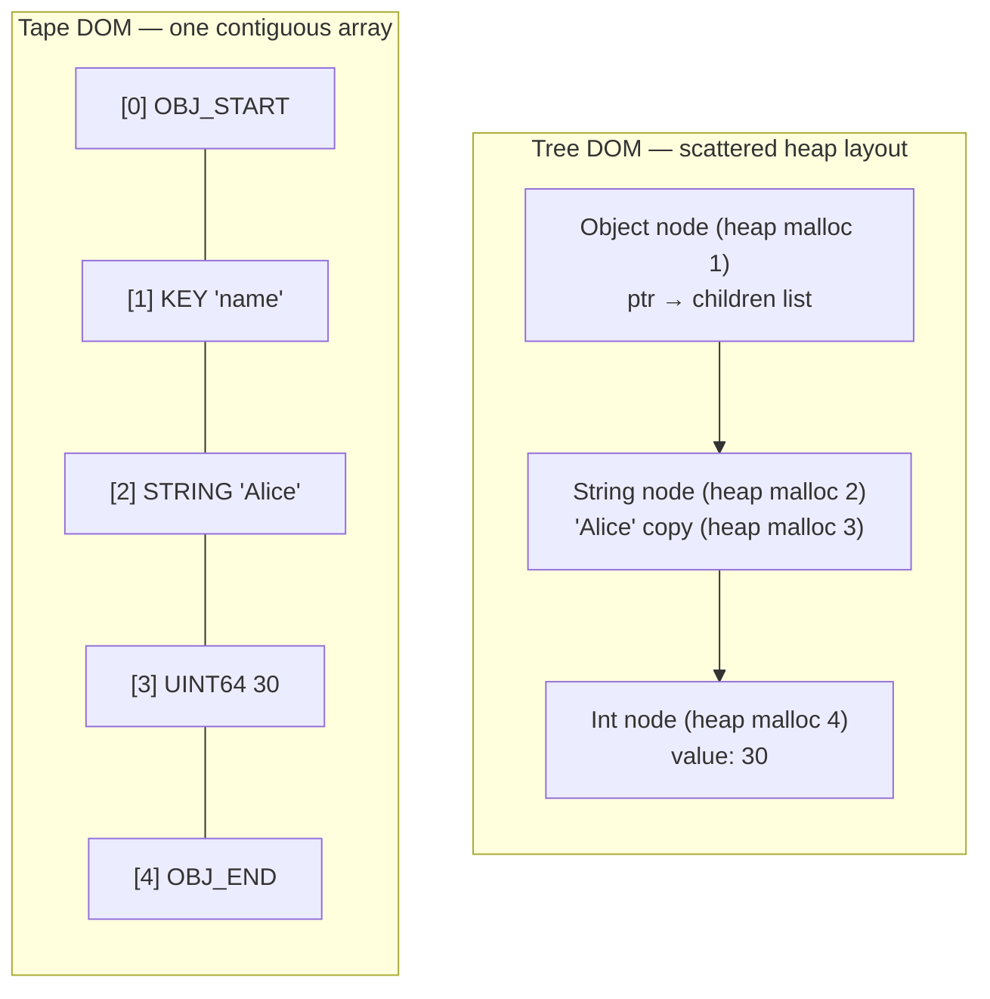
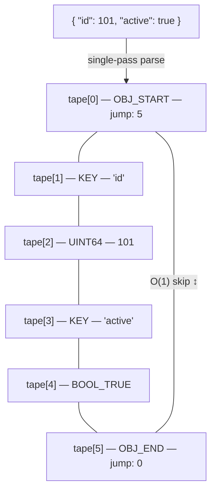
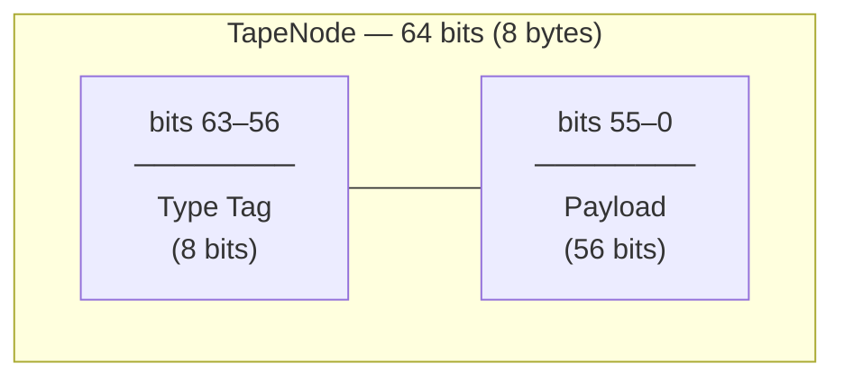
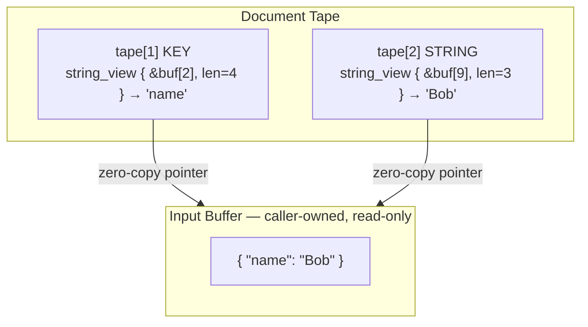
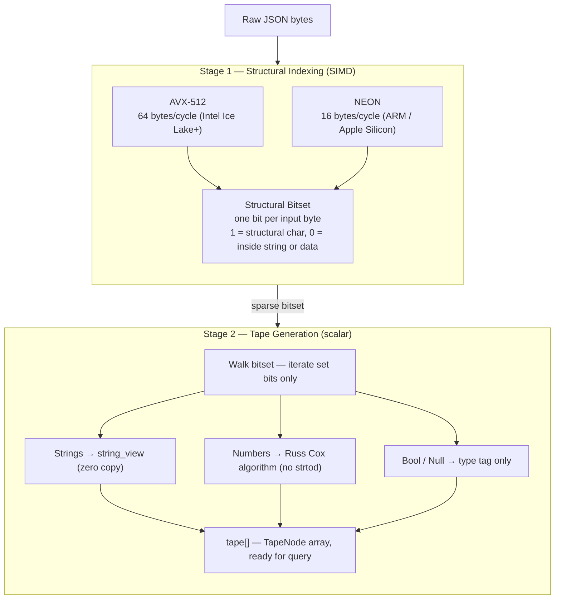
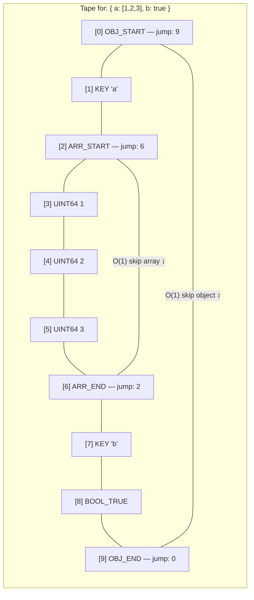

# The Tape Architecture

Beast JSON is built on a **Linear Tape DOM** — a design that fundamentally rejects the conventional tree-of-heap-nodes approach. Every JSON element maps to exactly one 64-bit `TapeNode` written into a single contiguous array. There is **one allocation, one pass, and zero pointer indirection** on the hot path.

---

## Why Conventional Parsers Are Slow

A tree-based DOM (e.g., `nlohmann/json`) allocates one heap node per JSON element. For a document with 10,000 elements, that means 10,000 `malloc` calls and 10,000 scattered heap objects — guaranteed cache misses on every traversal.



| | Tree DOM | Tape DOM |
|:---|:---|:---|
| Allocations per document | N (one per element) | **1** |
| Memory layout | Scattered heap objects | **Contiguous array** |
| Cache behavior | Pointer chase on every access | **Sequential scan** |
| String storage | Heap-copied `std::string` | **Zero-copy `string_view`** |
| Object skip | O(N) traversal | **O(1) via jump index** |

---

## Memory Layout: The Linear Tape

Given this input:

```json
{ "id": 101, "active": true }
```

Beast JSON performs one pass and writes 6 sequential 8-byte slots:



Reading this diagram:
- `tape[0]` stores `5` in its payload — the index of the matching `OBJ_END`. Skipping the entire object is a single array read: `tape[tape[0].jump]`.
- `tape[1]` and `tape[3]` (KEY) store a `string_view` pointing into the original input buffer. No allocation, no copy.
- `tape[2]` (UINT64) stores the integer `101` directly in the 56-bit payload field.
- `tape[4]` (BOOL_TRUE) needs only the type tag — payload is unused.

---

## TapeNode: 64-Bit Encoding

Every element — object, array, string, integer, float, bool, null — is encoded in exactly **8 bytes**:



**Type tag values:**

| Tag | Name | Payload meaning |
|:---|:---|:---|
| `0x01` | `OBJ_START` | Index of matching `OBJ_END` |
| `0x02` | `OBJ_END` | Index of matching `OBJ_START` |
| `0x03` | `ARR_START` | Index of matching `ARR_END` |
| `0x04` | `ARR_END` | Index of matching `ARR_START` |
| `0x05` | `KEY` | `ptr` (48-bit) + `len` (8-bit) into input buffer |
| `0x06` | `STRING` | `ptr` (48-bit) + `len` (8-bit) into input buffer |
| `0x07` | `UINT64` | Value stored inline (up to 2⁵⁶ − 1) |
| `0x08` | `INT64` | Value stored inline (sign-extended) |
| `0x09` | `DOUBLE` | Bit-cast from `double` |
| `0x0A` | `BOOL_TRUE` | Unused |
| `0x0B` | `BOOL_FALSE` | Unused |
| `0x0C` | `NULL_VAL` | Unused |

The 8-bit type tag is handled by a branch-predictor-friendly `switch`. The 56-bit payload accommodates a 48-bit virtual address plus an 8-bit length hint — enough for a `string_view` with no heap involved.

---

## Zero-Copy String Model

String data is **never copied**. KEY and STRING nodes store a `string_view` pointing directly into the caller's input buffer:



`string_view` lifetime: valid as long as both the `Document` and the input buffer are alive. The input buffer must not be modified or freed while any `Value` referencing it exists.

---

## Multi-Stage SIMD Pipeline

Parsing runs in two tightly coupled stages across the same input buffer:



Stage 1 runs at near-memory-bandwidth speed by processing 64 bytes per instruction. Stage 2 only visits structural positions (5–15% of the input), making it branch-prediction-friendly and cache-hot.

---

## Object and Array Traversal

Jump pointers in `OBJ_START` / `OBJ_END` and `ARR_START` / `ARR_END` enable sub-linear traversal:



Use case: querying only key `"b"` in an object with a huge nested array under `"a"`. The parser jumps from `ARR_START` directly to `ARR_END` in one step — O(1) regardless of array size.

---

## Why This Beats Tree-Based DOMs

| Metric | Beast JSON Tape | nlohmann/json | simdjson |
|:---|:---|:---|:---|
| **Memory layout** | Contiguous array | Scattered heap | Tape (no serialization) |
| **Allocations per parse** | 1 (tape itself) | O(N elements) | 2 (tape + strings) |
| **String storage** | Zero-copy `string_view` | Heap-copied `std::string` | Zero-copy `string_view` |
| **Object skip** | O(1) jump | O(N) recursion | O(1) jump |
| **Serialize support** | Yes (Stream-Push) | Yes | No (read-only DOM) |
| **Cache misses / element** | ~0 (sequential) | 1–3 (pointer chase) | ~0 (sequential) |
| **Peak RSS (twitter.json)** | 3.4 MB | 27.4 MB | 11.0 MB |
