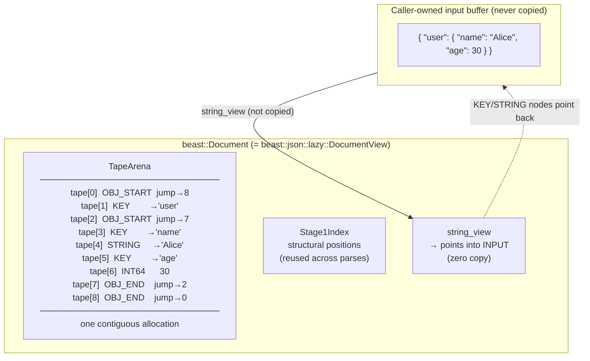
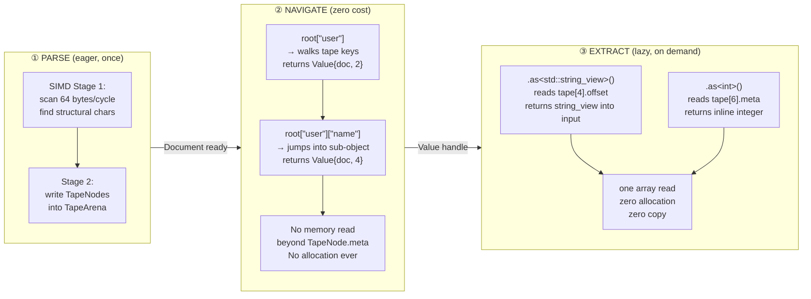
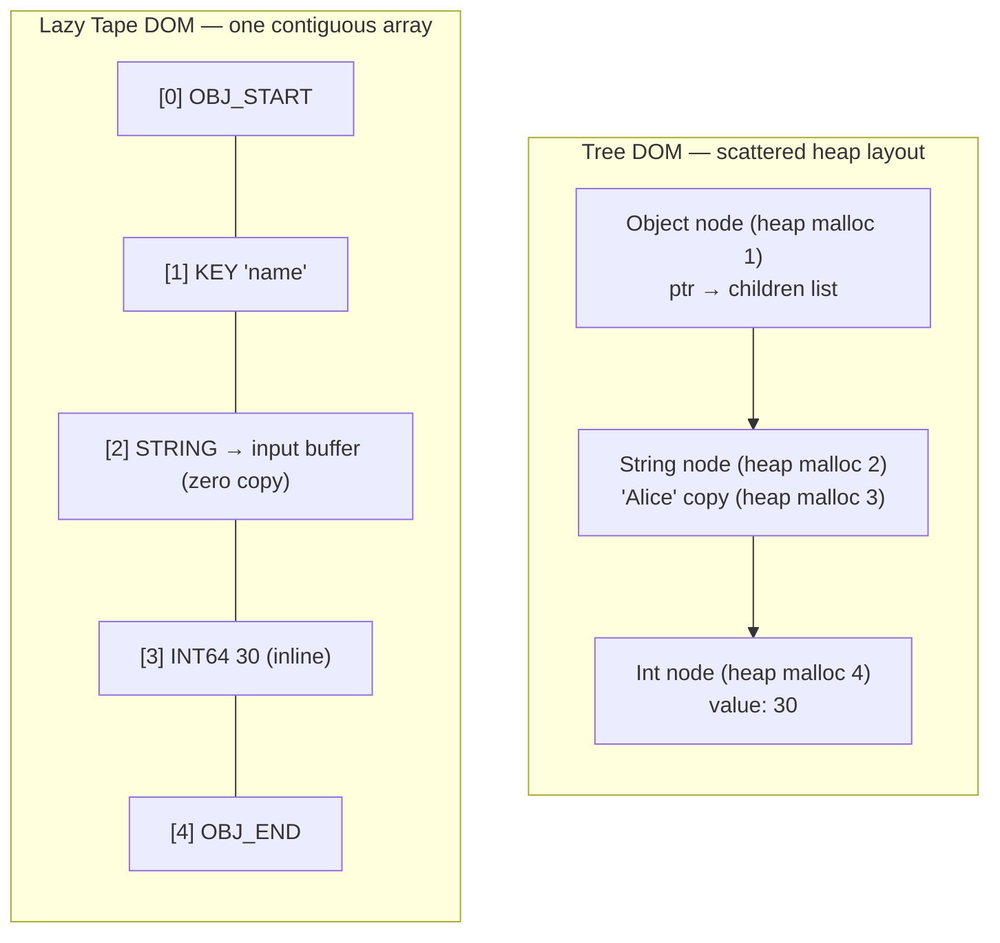
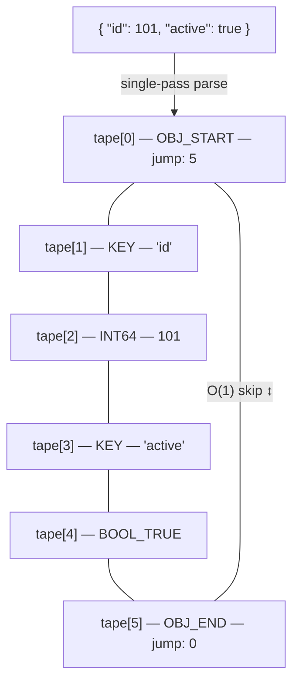
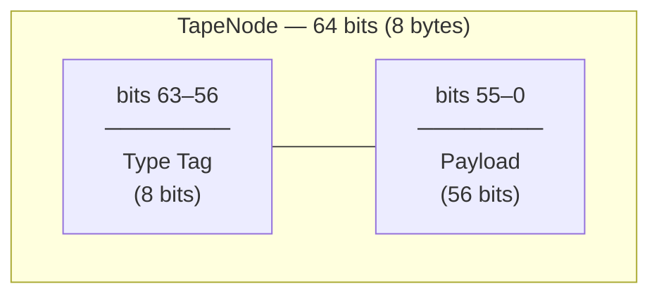
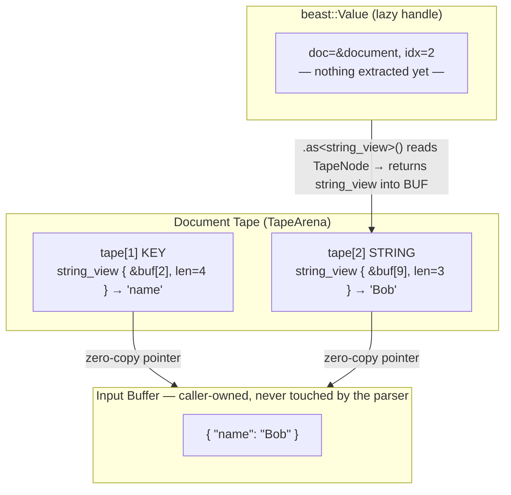
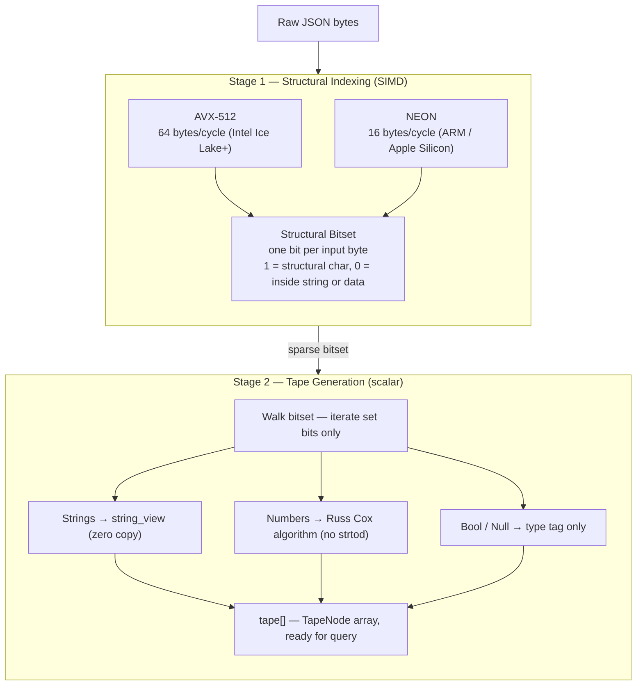
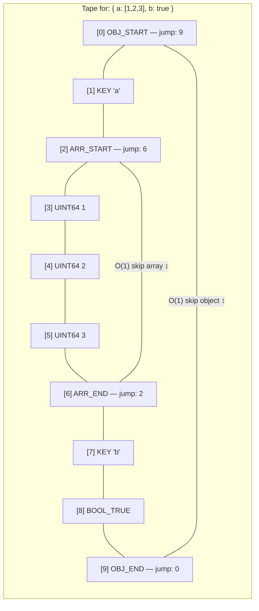

# The Lazy Tape DOM Architecture

Beast JSON's **Lazy Tape DOM** is an original parsing architecture designed from first principles to solve three specific problems that exist in every conventional JSON parser. It is not an incremental improvement — it is a different model of what a DOM should be.

This page explains:
- **The problems** that motivated the design
- **The theory** behind the two-part Lazy Tape model
- **The mechanisms** that implement it
- **The payoff** — which problem each decision solves

---

## The Problem: What Conventional Parsers Get Wrong

Every mainstream JSON parser makes the same three architectural mistakes:

### Problem 1 — Heap Scatter

Tree-based parsers (`nlohmann/json`, `RapidJSON`) allocate one heap node per element.
A 10,000-element document triggers 10,000 `malloc` calls. Each node lands at a
random address. Every access is a pointer chase, every pointer chase is a cache miss.

```
Input: { "a": 1, "b": 2, "c": 3 }

nlohmann/json memory layout:
  [heap addr 0x5a40] Object node  → ptr → [0x7f23] children vector
  [heap addr 0x7f23] "a"          → ptr → [0x3c11] IntNode(1)
  [heap addr 0x3c11] IntNode(1)
  [heap addr 0x9d04] "b"          → ptr → [0x12ef] IntNode(2)
  ...scattered across 8 different cache lines for 3 elements
```

### Problem 2 — Eager String Copy

Most parsers immediately allocate and copy every string value at parse time —
even strings the caller never reads. A 50 KB JSON payload with 200 string values
produces 200 separate heap allocations, whether you read 1 of them or all 200.

### Problem 3 — No Skip Mechanism

Conventional DOMs give every element equal weight. To find key `"z"` in an object,
the parser must walk past every sibling. To skip a nested array with 5,000 elements,
it must visit all 5,000. There is no way to say "skip this subtree in O(1)".

---

## The Lazy Tape DOM: The Two-Principle Solution

Beast JSON resolves all three problems with a single unified design built on two
inseparable principles:

```
┌──────────────────────────────────────────────────────────────────┐
│                     LAZY TAPE DOM                                │
│                                                                  │
│  ┌─────────────────────────┐   ┌──────────────────────────────┐  │
│  │         TAPE            │   │           LAZY               │  │
│  │                         │   │                              │  │
│  │  All nodes in one flat  │   │  Value = handle only.        │  │
│  │  contiguous array.      │   │  No data extracted until     │  │
│  │  One malloc. Zero       │   │  you call .as<T>().          │  │
│  │  pointer chasing.       │   │  Navigate costs nothing.     │  │
│  │  Jump indices for O(1)  │   │  Extract costs one array     │  │
│  │  subtree skip.          │   │  read.                       │  │
│  └─────────────────────────┘   └──────────────────────────────┘  │
│       solves Problem 1 & 3          solves Problem 2             │
└──────────────────────────────────────────────────────────────────┘
```

The namespace `beast::json::lazy` directly names this principle.

---

## DocumentView: The Single Allocation

Parsing produces a `DocumentView` — a single heap object that owns everything.



- `TapeArena` is a single `malloc`. On repeated parses it is **reused in-place** (reset cursor, keep capacity).
- `Stage1Index` is the SIMD-produced structural position list. Also reused without reallocation.
- The input buffer is **never copied**. `string_view` pointers go directly into the caller's memory.

---

## Value: The Lazy Handle

`beast::Value` holds exactly two fields — 16 bytes total:

```
struct Value {          // 16 bytes
    DocumentView* doc_; //  8 bytes — which document
    uint32_t      idx_; //  4 bytes — which tape slot
    uint32_t      pad_; //  4 bytes — alignment
};
```

This is the "lazy" half of the design. A `Value` is not a value — it is a **position**.

### The Three-Phase Lifecycle



**The key insight:** the caller controls when extraction happens.
If you navigate to `root["user"]["name"]` and never call `.as<>()`,
the string bytes are never touched. This is qualitatively different from
every eager parser — you pay only for what you read.

---

## Why Conventional Parsers Are Slow

A tree-based DOM allocates one heap node per JSON element. For a document with 10,000 elements, that means 10,000 `malloc` calls and 10,000 scattered heap objects — guaranteed cache misses on every traversal.



| | Tree DOM | Lazy Tape DOM |
|:---|:---|:---|
| Allocations per document | N (one per element) | **1** |
| Memory layout | Scattered heap objects | **Contiguous array** |
| Cache behavior | Pointer chase on every access | **Sequential scan** |
| String storage | Heap-copied `std::string` | **Zero-copy `string_view`** |
| Object skip | O(N) traversal | **O(1) via jump index** |
| Extraction cost | Paid at parse time (always) | **Paid at `.as<T>()` (on demand)** |

---

## Memory Layout: The Linear Tape

Given this input:

```json
{ "id": 101, "active": true }
```

Beast JSON performs one pass and writes 6 sequential 8-byte slots:



Reading this diagram:
- `tape[0]` stores `5` in its payload — the index of the matching `OBJ_END`. Skipping the entire object is a single array read: `tape[tape[0].jump]`.
- `tape[1]` and `tape[3]` (KEY) store a `string_view` pointing into the original input buffer. No allocation, no copy.
- `tape[2]` (INT64) stores `101` directly in the 56-bit payload field. No heap involved.
- `tape[4]` (BOOL_TRUE) needs only the type tag — payload is unused.

---

## TapeNode: 64-Bit Encoding

Every element — object, array, string, integer, float, bool, null — is encoded in exactly **8 bytes**:



**Type tag values:**

| Tag | Name | Payload meaning |
|:---|:---|:---|
| `0x01` | `OBJ_START` | Index of matching `OBJ_END` |
| `0x02` | `OBJ_END` | Index of matching `OBJ_START` |
| `0x03` | `ARR_START` | Index of matching `ARR_END` |
| `0x04` | `ARR_END` | Index of matching `ARR_START` |
| `0x05` | `KEY` | `ptr` (48-bit) + `len` (8-bit) into input buffer |
| `0x06` | `STRING` | `ptr` (48-bit) + `len` (8-bit) into input buffer |
| `0x07` | `UINT64` | Value stored inline (up to 2⁵⁶ − 1) |
| `0x08` | `INT64` | Value stored inline (sign-extended) |
| `0x09` | `DOUBLE` | Bit-cast from `double` |
| `0x0A` | `BOOL_TRUE` | Unused |
| `0x0B` | `BOOL_FALSE` | Unused |
| `0x0C` | `NULL_VAL` | Unused |

The 8-bit type tag is handled by a branch-predictor-friendly `switch`. The 56-bit payload accommodates a 48-bit virtual address plus an 8-bit length hint — enough for a `string_view` with no heap involved.

---

## Zero-Copy String Model

String data is **never copied**. KEY and STRING nodes store a `string_view` pointing directly into the caller's input buffer:



`string_view` lifetime: valid as long as both the `Document` and the input buffer are alive.
The input buffer must not be modified or freed while any `Value` referencing it exists.

---

## Multi-Stage SIMD Pipeline

Parsing runs in two tightly coupled stages across the same input buffer:



Stage 1 runs at near-memory-bandwidth speed by processing 64 bytes per instruction.
Stage 2 only visits structural positions (5–15% of the input), making it branch-prediction-friendly and cache-hot.

---

## Object and Array Traversal

Jump pointers in `OBJ_START` / `OBJ_END` and `ARR_START` / `ARR_END` enable sub-linear traversal:



Use case: querying only key `"b"` in an object with a huge nested array under `"a"`. The parser jumps from `ARR_START` directly to `ARR_END` in one step — O(1) regardless of array size.

---

## Design Principles → Problems Solved

Every decision in the Lazy Tape DOM traces directly to one of the three original problems:

| Design decision | Solves | How |
|:---|:---|:---|
| One contiguous `TapeArena` | Problem 1 — Heap Scatter | Single `malloc`, sequential layout, zero pointer chasing |
| 8-byte fixed-size `TapeNode` | Problem 1 — Heap Scatter | CPU cache line holds 8 nodes; prefetcher works perfectly |
| `OBJ_START`/`ARR_START` jump index | Problem 3 — No Skip | Subtree skip is one integer read, O(1) regardless of depth or size |
| `string_view` into input buffer | Problem 2 — Eager Copy | Zero bytes copied at parse time; string is only touched if `.as<string_view>()` is called |
| `Value` = 16-byte handle `{doc*, idx}` | Problem 2 — Eager Copy | Navigation produces no data, no allocation; extraction is opt-in |
| SIMD Stage 1 structural scan | Problem 1 — Heap Scatter | Structural chars identified at memory-bandwidth speed before any allocation |
| `Stage1Index` reuse across parses | Problem 1 — Heap Scatter | Hot-loop parsing (JSON streams) reuses both tape and index without any `malloc` |

Taken together:

```
You pay the cost of parsing exactly once.
You pay the cost of navigation never.
You pay the cost of extraction only for the fields you actually read.
```

---

## Why This Beats Tree-Based DOMs

| Metric | Beast JSON (Lazy Tape) | nlohmann/json | simdjson |
|:---|:---|:---|:---|
| **Memory layout** | Contiguous array | Scattered heap | Tape (read-only) |
| **Allocations per parse** | 1 (tape itself) | O(N elements) | 2 (tape + strings) |
| **String storage** | Zero-copy `string_view` | Heap-copied `std::string` | Zero-copy `string_view` |
| **Object/array skip** | O(1) jump | O(N) recursion | O(1) jump |
| **Extraction model** | Lazy — on demand | Eager — at parse time | Lazy — on demand |
| **Mutation support** | Yes (overlay map) | Yes (in-place) | No (read-only DOM) |
| **Serialize support** | Yes | Yes | No |
| **Cache misses / element** | ~0 (sequential) | 1–3 (pointer chase) | ~0 (sequential) |
| **Peak RSS (twitter.json)** | 3.4 MB | 27.4 MB | 11.0 MB |
