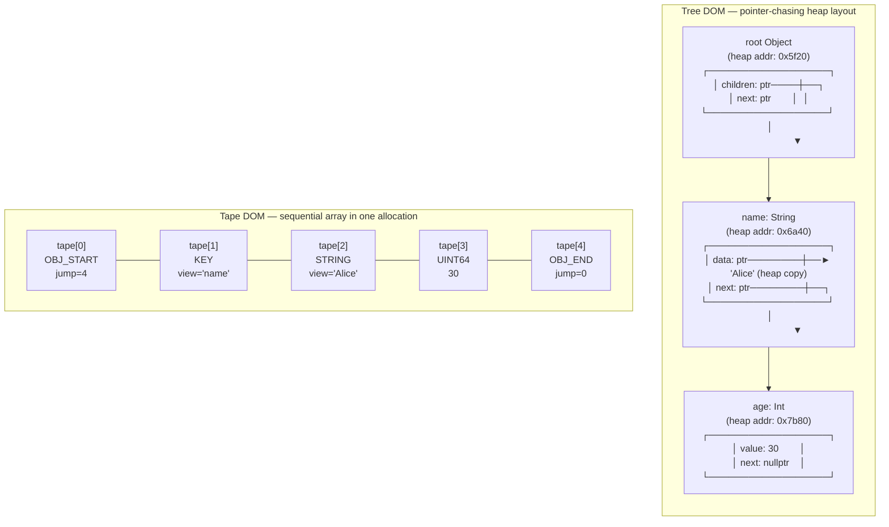
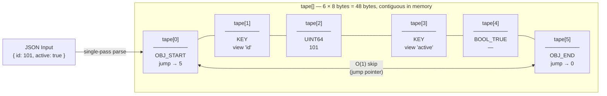
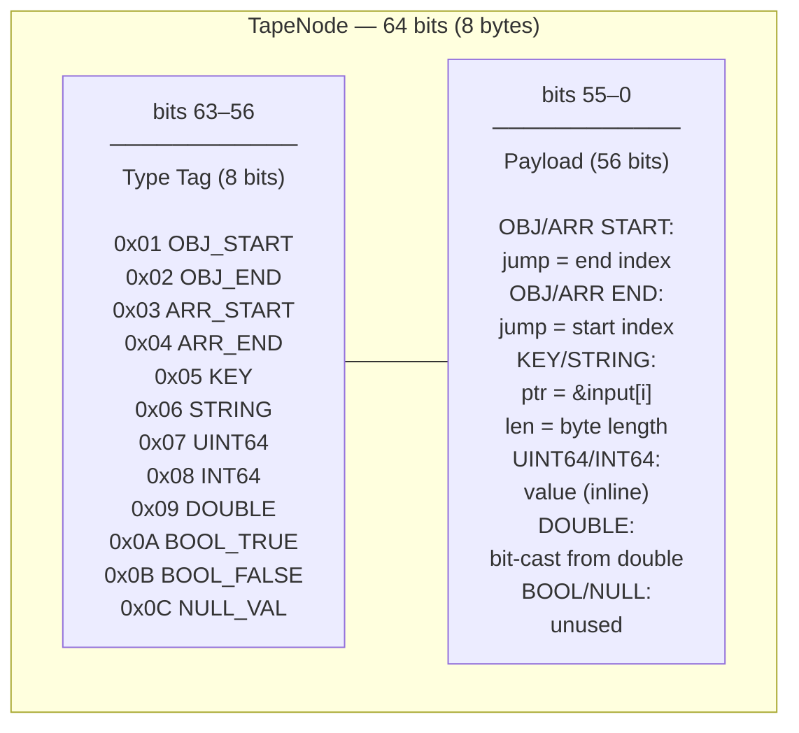
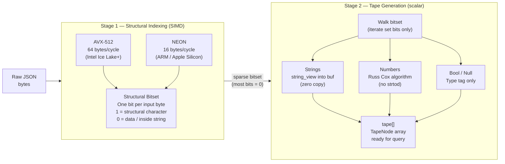
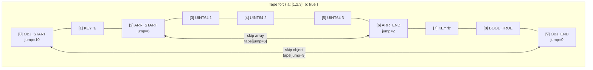

# The Tape Architecture

Beast JSON is built on a **Linear Tape DOM** — a design that fundamentally rejects the conventional tree-of-heap-nodes approach. Every JSON element maps to exactly one 64-bit `TapeNode` written into a single contiguous array. There is **one allocation, one pass, and zero pointer indirection** on the hot path.

---

## Why Conventional Parsers Are Slow

A tree-based DOM (e.g., `nlohmann/json`) allocates one heap node per JSON element. For a document with 10,000 elements, that means 10,000 `malloc` calls and 10,000 scattered heap objects — guaranteed cache misses on every traversal.



| | Tree DOM | Tape DOM |
|:---|:---|:---|
| Allocations per document | N (one per element) | **1** |
| Memory layout | Scattered heap objects | **Contiguous array** |
| Cache behavior | Pointer chase on every access | **Sequential scan** |
| String storage | Heap-copied `std::string` | **Zero-copy `string_view`** |
| Object skip | O(N) traversal | **O(1) via jump index** |

---

## Memory Layout: The Linear Tape

Given this input:

```json
{ "id": 101, "active": true }
```

Beast JSON performs one pass and writes this array (indices 0–5 are sequential memory addresses):



Reading this diagram:
- `tape[0]` (OBJ_START) stores `5` in its payload — the index of the matching `OBJ_END`. Skipping the entire object means reading `tape[tape[0].jump]` — one array access.
- `tape[1]` and `tape[3]` (KEY) store a `string_view` pointing into the original input buffer. No allocation, no copy.
- `tape[2]` (UINT64) stores the integer `101` directly in the 56-bit payload.
- `tape[4]` (BOOL_TRUE) needs only the type tag. Payload is unused.

---

## TapeNode: 64-Bit Encoding

Every element — object, array, string, integer, float, bool, null — is encoded in exactly **8 bytes**:



The 8-bit type tag fits in one byte, leaving 56 bits for the payload. On 64-bit systems, a virtual address only uses 48 bits (or 57 bits with 5-level paging), so a pointer plus an 8-bit length hint fits in the payload for short strings — no heap involved.

---

## Zero-Copy String Model

String data is **never copied**. KEY and STRING nodes store a `string_view` whose `.data()` points directly into the caller's input buffer:

```mermaid
flowchart TB
    subgraph BUF["Input Buffer  —  caller-owned, read-only"]
        direction LR
        B0["[0]\n'{'"]
        B1["[1]\n'\"'"]
        B2["[2]\n'i'"]
        B3["[3]\n'd'"]
        B4["[4]\n'\"'"]
        B5["[5]\n':'"]
        B6["[6]\n'1'"]
        B7["[7]\n'0'"]
        B8["[8]\n'1'"]
        B9["[9]\n','"]
        B0 --- B1 --- B2 --- B3 --- B4 --- B5 --- B6 --- B7 --- B8 --- B9
    end

    subgraph TN1["tape[1]  KEY"]
        K["string_view\ndata = &buf[2]\nlen  = 2\n→ 'id'"]
    end

    subgraph TN2["tape[2]  UINT64"]
        V["payload\n= 101\n(stored inline)"]
    end

    K -->|"points into\noriginal buffer\n(zero copy)"| B2
    V -.- B6
```

`string_view` lifetime: valid as long as both the `Document` and the input buffer are alive. The input buffer must not be modified or freed while any `Value` referencing it exists.

---

## Multi-Stage SIMD Pipeline

Parsing runs in two tightly coupled stages across the same input buffer:



Stage 1 is the bandwidth-bound phase — it runs at near-memory-bandwidth speed by processing 64 bytes per instruction. Stage 2 only visits structural positions (a small fraction of the total input), making it branch-prediction-friendly and cache-hot.

---

## Object and Array Traversal

The jump pointers in OBJ_START / OBJ_END (and ARR_START / ARR_END) enable sub-linear traversal:



Use case: querying only key `"b"` in a large object with a huge nested array under `"a"`. With jump pointers, the parser jumps from `ARR_START` directly to `ARR_END` in one step — O(1) regardless of array size.

---

## Why This Beats Tree-Based DOMs

| Metric | Beast JSON Tape | nlohmann/json | simdjson |
|:---|:---|:---|:---|
| **Memory layout** | Contiguous array | Scattered heap | Tape (no serialization) |
| **Allocations per parse** | 1 (tape itself) | O(N elements) | 2 (tape + strings) |
| **String storage** | Zero-copy `string_view` | Heap-copied `std::string` | Zero-copy `string_view` |
| **Object skip** | O(1) jump | O(N) recursion | O(1) jump |
| **Serialize support** | Yes (Stream-Push) | Yes | No (read-only DOM) |
| **Cache misses / element** | ~0 (sequential) | 1–3 (pointer chase) | ~0 (sequential) |
| **Peak RSS (twitter.json)** | 3.4 MB | 27.4 MB | 11.0 MB |
