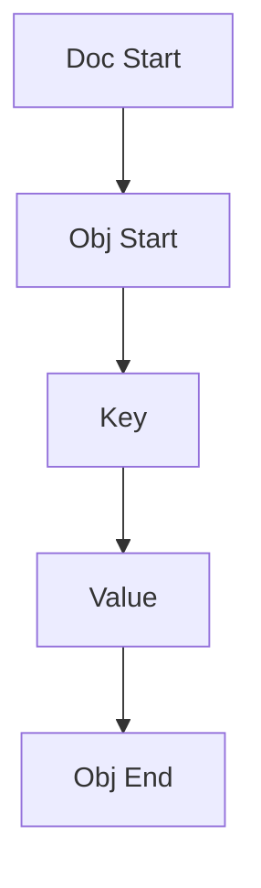

# The Tape Architecture

Beast JSON operates on a **Linear Tape DOM** model. Unlike tree-based DOMs (like `nlohmann/json`) that use pointer-heavy node structures, Beast JSON linearizes the JSON structure into a single, cache-friendly array.

## 🧱 Memory Layout: The Linear Tape

```mermaid
flowchart TB
    STR["JSON Input<br/>{ id: 101, active: true }"]

    STR -.->|parse| N1

    subgraph Tape_DOM["Beast JSON Tape (64-bit Blocks)"]
        direction TB
        N1["[OBJ_START]"]
        N2["[key: id]"]
        N3["[101]"]
        N4["[key: active]"]
        N5["[TRUE]"]
        N6["[OBJ_END]"]

        N1 --> N2
        N2 --> N3
        N3 --> N4
        N4 --> N5
        N5 --> N6
    end

    style Tape_DOM fill:#05070a,stroke:#00e5ff,stroke-width:2px
    style STR fill:#0b1016,stroke:#00e5ff,stroke-width:1px,color:#ffffff
```

## 🏗️ Sequential Tape Layout

Every JSON element is converted into an 8-byte `TapeNode`. This allows for extremely fast sequential access and near-instant traversal.

### Advantages of Tape DOM:
1. **Cache Locality**: Iterating through an object or array is a simple linear scan of the tape.
2. **Zero Pointer Manipulation**: Reduces branch mispredictions and memory fragmentation.
3. **Instant Memory Mapping**: The DOM is essentially just a vector of 64-bit integers.

## 🚄 Multi-Stage SIMD Pipeline

Parsing is split into distinct stages to maximize CPU parallelization:

### Stage 1: Structural Indexing (AVX-512 / NEON)
The parser scans the raw input for structural characters (`{`, `}`, `[`, `]`, `:`, `,`, `"`, `\`). 
- **AVX-512**: Processes 64 bytes per instruction.
- **NEON**: Processes 16 bytes per instruction.

### Stage 2: Tape Generation
Using the structural index, the parser performs a single pass to build the Tape nodes. 
Strings and numbers are handled via specialized fast-paths:
- **Strings**: Direct pointer copy (zero-allocation).
- **Numbers**: **Russ Cox Algorithm** for exact, unrounded scaling.

## 💎 Zero-Allocation Principle

Beast JSON avoids `new` or `malloc` during the critical parsing path. 
- All strings are stored as `std::string_view` pointing into the source buffer.
- All numbers are parsed directly into internal Tape registers.

This design makes it the ideal candidate for **HFT (High-Frequency Trading)** and **Real-Time Embedded Systems** where latency jitter is unacceptable.
