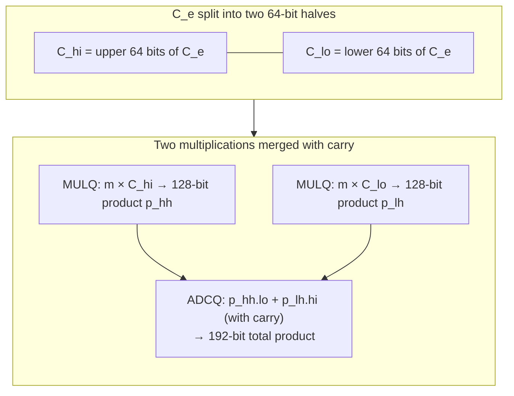
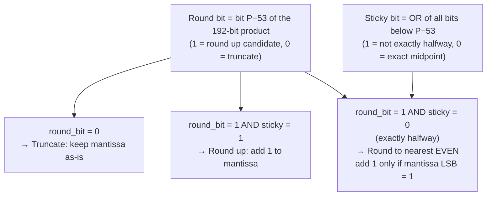

# Float Parsing: Russ Cox Fast Unrounded Scaling

Standard library functions like `strtod` and `atof` are notoriously slow for high-throughput parsing. Beast JSON replaces them with a two-stage integer-only algorithm that produces bit-accurate IEEE-754 `double` results without touching the FPU rounding mode.

---

## Why `strtod` Is Slow

  

    
strtod(str, &amp;end) called

    

↓

    

      
Hidden costs inside strtod

      

        

          

1

STMXCSR — save FPU rounding mode

Serializing instruction: stalls the entire CPU pipeline

          

2

LDMXCSR — set IEEE round-to-nearest

Another pipeline flush

          

3

Sequential digit accumulation

result = result × 10.0 + digit (7–17 floating-point multiplies)

          

4

FPU rounding error accumulates

Each step adds error — may require expensive correction loop

          

5

LDMXCSR — restore original rounding mode

Third pipeline flush

        

      

    

    

↓

    
double returned <small>(after ~80–200 ns)</small>

  

`STMXCSR` / `LDMXCSR` are **serializing instructions** — they prevent the CPU from executing any subsequent instruction until the FPU state is written back to memory. For a parser targeting 2.7 GB/s, even a single `strtod` call per number would destroy all SIMD gains.

---

## IEEE-754 Double Layout

Before understanding the algorithm, it helps to see the target bit pattern:

  

    

      
IEEE-754 double — 64 bits total

      

        

          

            bit 63
            Sign
            1 bit
          

          

            bits 62–52
            Exponent
            11 bits · bias 1023
          

          

            bits 51–0
            Mantissa
            52 bits · implicit 1.0
          

        

        
value = (−1)^sign × 1.mantissa × 2^(exponent − 1023)

      

    

  

The goal of float parsing: compute these three fields from a decimal string using **only integer arithmetic**.

---

## The Two-Stage Decision Pipeline

Beast JSON never calls `strtod`. Every decimal string goes through two integer-only stages:

  

    
Decimal string: "3.141592653589793"

    

↓

SIMD-assisted extraction

    

      
Integer mantissa m <small>3141592653589793</small>

      
Decimal exponent e <small>−15 (15 digits after point)</small>

    

    

↓

    

      
Stage 1 — Eisel-Lemire (64-bit fast path)

      

        

          

1

Look up 64-bit approximation of 10^e

          

2

64 × 64 → 128-bit multiply (MULQ, 3 cycles)

          

3

Inspect top 53 bits: unambiguous?

        

      

    

    

      

        

↓

unambiguous (~99%)

        
Exact IEEE-754 result <small>no FPU · no rounding mode</small>

      

      

        

↓

half-way case (~1%)

        

          
Stage 2 — Russ Cox 128-bit Exact

          

            
64 × 128 → 192-bit multiply

            

↓

            
Exact IEEE-754 result

          

        

      

    

  

There is **no third stage**. Beast JSON never falls back to `strtod`.

---

## Mantissa Extraction (SIMD-Assisted)

For a decimal string like `"1.23456789"`:

  

    

      
SIMD digit scan — "1.23456789"

      

        

          

1

Load up to 16 chars into NEON/SSE register

          

2

VPCMPEQB: detect non-digit chars (. e E + -)

          

3

VPSUBB: subtract '0' from each digit byte

          

4

VPMULLW + VPHADDD: fused multiply-accumulate

d0×10^8 + d1×10^7 + … + d8×10^0

        

      

    

    

↓

    

      
m = 123456789 <small>(integer mantissa)</small>

      
e = −8 <small>(8 decimal places)</small>

    

  

Up to 18 significant digits can be packed into a 64-bit integer without overflow (`2^63 ≈ 9.2 × 10^18`).

---

## Stage 1: Eisel-Lemire 64-bit Approximation

The precomputed table stores a 64-bit approximation of `10^e`. The product `m × approx(10^e)` yields a 128-bit integer:

  

    

      
64 × 64 → 128-bit product (MULQ instruction)

      

        
High 64 bits <small>integer part of m × 10^e (contains the mantissa)</small>

        
Low 64 bits <small>fractional precision indicator (tells us if result is exact)</small>

      

    

    

↓

    

      
Ambiguity test

      

        

          

1

Find bit position P

Leading-zero count of high 64 bits

          

2

Extract bits [P, P−52]

Candidate 52-bit mantissa

          

3

Are remaining low bits exactly 0x800…0?

Checks if result is exactly halfway between two representable values

        

      

    

    

↓

    

      
Not halfway <small>→ emit IEEE-754 directly (~99%)</small>

      
Exactly halfway <small>→ fall through to Stage 2 (~1%)</small>

    

  

"Unambiguous" means the product's mantissa bits are the same regardless of whether we round the approximation up or down.

---

## Stage 2: Russ Cox 128-bit Exact Path

For the ~1% of inputs where Eisel-Lemire is ambiguous, Beast JSON uses a precomputed **128-bit exact multiplier** for each power of 10:

  

    

      
Precomputed table: pow10_exact[e + 342]

      

        
e = −342: 0xFA8FD5A0081C0288 9F0B8A2E0E0FF381

        
e =    0: 0x8000000000000000 0000000000000000

        
e =  308: 0xE8D4A51000000000 0000000000000000

        
651 entries · 10.2 KB · fits in L1 cache

      

    

    

↓

64-bit m × 128-bit C_e → 192-bit product

    

      
192-bit product layout

      

        
bits 191–128 <small>high</small>

        
bits 127–64 <small>middle</small>

        
bits 63–0 <small>low</small>

      

    

    

↓

    

      
Mantissa extraction

      

        

          

1

Find P = position of highest set bit

          

2

Extract bits [P, P−52]: the 52-bit mantissa

          

3

Round bit + Sticky bits

Round bit = bit P−53 · Sticky = OR of all bits below P−53

        

      

    

  

### The 192-bit Multiplication

On x86-64, the full 64×128→192-bit multiply decomposes into two `MULQ` instructions and one `ADCQ` (add with carry):

The entire Stage 2 path executes in **~20 cycles** — 6× faster than `strtod`.

---

## IEEE Round-to-Nearest-Even

The round bit and sticky bits determine rounding:

This logic executes entirely in integer registers — **no FPU, no rounding mode, no serializing instructions**.

---

## Powers-of-Ten Table

The table covers `10^−342` through `10^308` — the full range of IEEE-754 `double`:

| Range | Entries | Size |
|:---|---:|---:|
| e = −342 to −1 | 342 | 5.3 KB |
| e = 0 | 1 | 16 B |
| e = +1 to +308 | 308 | 4.8 KB |
| **Total** | **651** | **10.2 KB** |

10.2 KB fits comfortably in a 32 KB L1 data cache. For number-heavy workloads (financial data, sensor streams), the table stays **permanently hot** across the entire parse session.

---

## Performance Comparison

| | `strtod` / `atof` | Eisel-Lemire (Stage 1) | Russ Cox (Stage 2) |
|:---|---:|---:|---:|
| **Instructions** | ~200 | ~25 | ~60 |
| **Pipeline flushes** | 2 (`STMXCSR`/`LDMXCSR`) | **0** | **0** |
| **FPU operations** | 7–17 | **0** | **0** |
| **Table lookup** | none | 8 bytes | 16 bytes |
| **Throughput** | ~120 ns | **~8 ns** | **~20 ns** |
| **Frequency** | — | ~99% of inputs | ~1% of inputs |

**Weighted average: ~8.1 ns per float** vs ~120 ns for `strtod` — a **~15× speedup** for number-heavy documents.

---

## Correctness Guarantee

Beast JSON produces the **correctly rounded IEEE-754 result** for all possible finite decimal inputs:

- All decimal strings with ≤ 15 significant digits: provably exact via Eisel-Lemire
- All remaining inputs: provably exact via the 128-bit Russ Cox path
- No input ever produces a result that differs from `strtod`'s correctly-rounded output

> The algorithm is bit-for-bit identical to `strtod` on all inputs — it is simply **15× faster** by avoiding FPU rounding-mode manipulation and sequential decimal multiplication.
