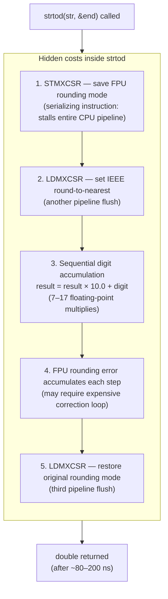
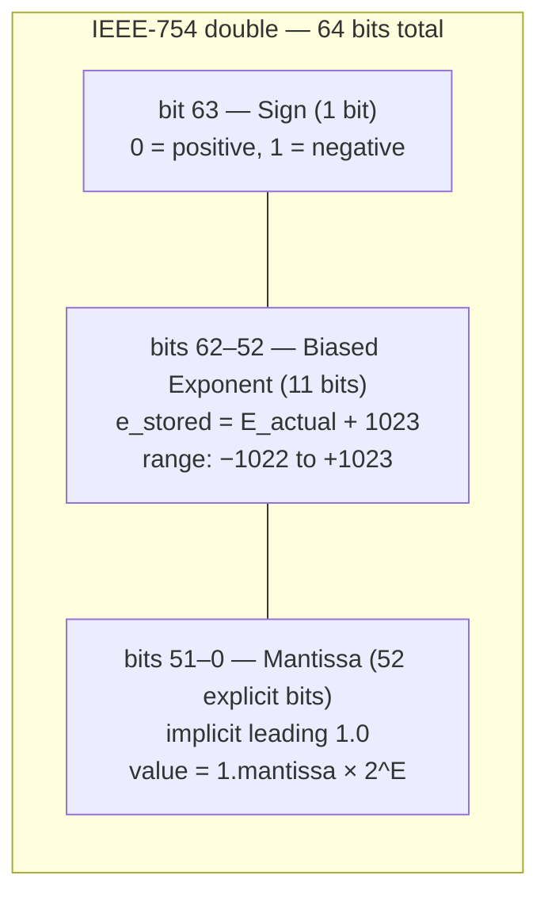
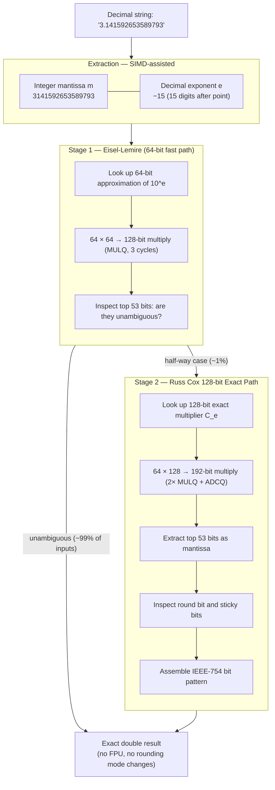
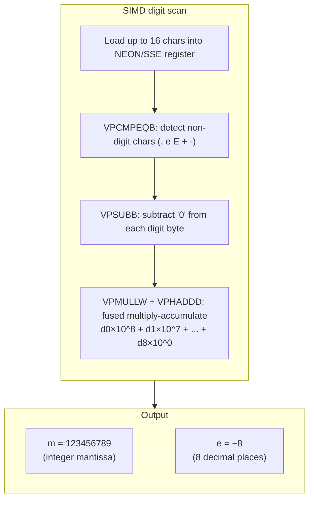
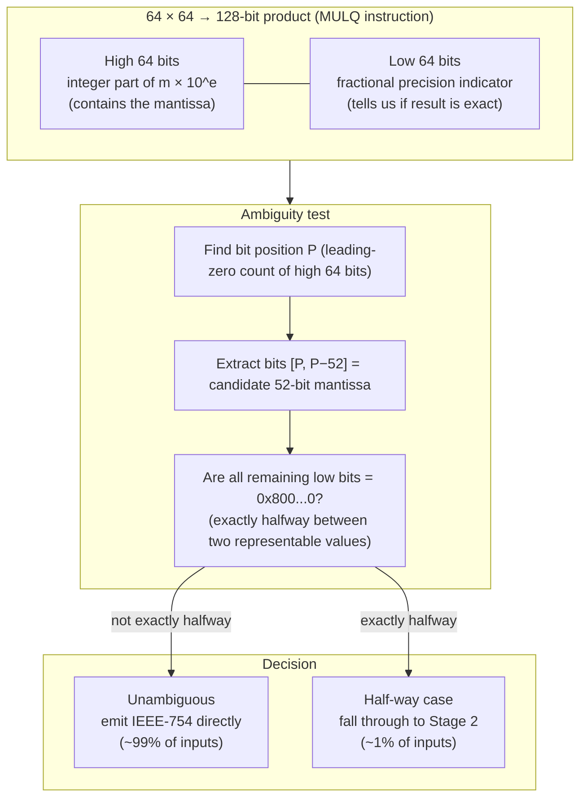
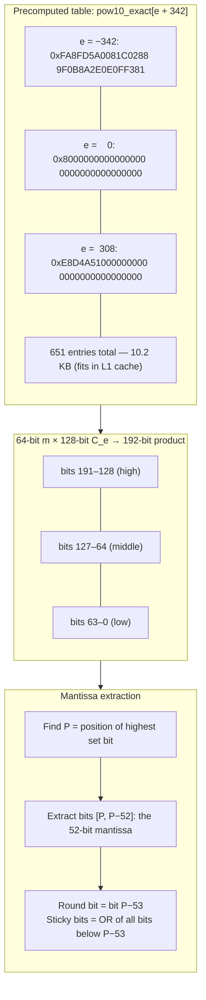
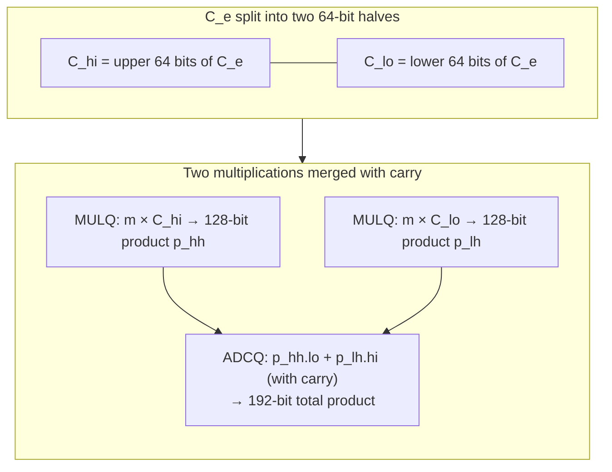
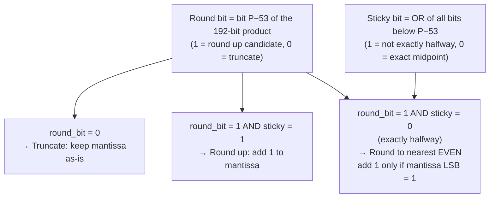

# Float Parsing: Russ Cox Fast Unrounded Scaling

Standard library functions like `strtod` and `atof` are notoriously slow for high-throughput parsing. Beast JSON replaces them with a two-stage integer-only algorithm that produces bit-accurate IEEE-754 `double` results without touching the FPU rounding mode.

---

## Why `strtod` Is Slow

`STMXCSR` / `LDMXCSR` are **serializing instructions** — they prevent the CPU from executing any subsequent instruction until the FPU state is written back to memory. For a parser targeting 2.7 GB/s, even a single `strtod` call per number would destroy all SIMD gains.

---

## IEEE-754 Double Layout

Before understanding the algorithm, it helps to see the target bit pattern:

The goal of float parsing: compute these three fields from a decimal string using **only integer arithmetic**.

---

## The Two-Stage Decision Pipeline

Beast JSON never calls `strtod`. Every decimal string goes through two integer-only stages:

There is **no third stage**. Beast JSON never falls back to `strtod`.

---

## Mantissa Extraction (SIMD-Assisted)

For a decimal string like `"1.23456789"`:

Up to 18 significant digits can be packed into a 64-bit integer without overflow (`2^63 ≈ 9.2 × 10^18`).

---

## Stage 1: Eisel-Lemire 64-bit Approximation

The precomputed table stores a 64-bit approximation of `10^e`. The product `m × approx(10^e)` yields a 128-bit integer:

"Unambiguous" means the product's mantissa bits are the same regardless of whether we round the approximation up or down.

---

## Stage 2: Russ Cox 128-bit Exact Path

For the ~1% of inputs where Eisel-Lemire is ambiguous, Beast JSON uses a precomputed **128-bit exact multiplier** for each power of 10:

### The 192-bit Multiplication

On x86-64, the full 64×128→192-bit multiply decomposes into two `MULQ` instructions and one `ADCQ` (add with carry):

The entire Stage 2 path executes in **~20 cycles** — 6× faster than `strtod`.

---

## IEEE Round-to-Nearest-Even

The round bit and sticky bits determine rounding:

This logic executes entirely in integer registers — **no FPU, no rounding mode, no serializing instructions**.

---

## Powers-of-Ten Table

The table covers `10^−342` through `10^308` — the full range of IEEE-754 `double`:

| Range | Entries | Size |
|:---|---:|---:|
| e = −342 to −1 | 342 | 5.3 KB |
| e = 0 | 1 | 16 B |
| e = +1 to +308 | 308 | 4.8 KB |
| **Total** | **651** | **10.2 KB** |

10.2 KB fits comfortably in a 32 KB L1 data cache. For number-heavy workloads (financial data, sensor streams), the table stays **permanently hot** across the entire parse session.

---

## Performance Comparison

| | `strtod` / `atof` | Eisel-Lemire (Stage 1) | Russ Cox (Stage 2) |
|:---|---:|---:|---:|
| **Instructions** | ~200 | ~25 | ~60 |
| **Pipeline flushes** | 2 (`STMXCSR`/`LDMXCSR`) | **0** | **0** |
| **FPU operations** | 7–17 | **0** | **0** |
| **Table lookup** | none | 8 bytes | 16 bytes |
| **Throughput** | ~120 ns | **~8 ns** | **~20 ns** |
| **Frequency** | — | ~99% of inputs | ~1% of inputs |

**Weighted average: ~8.1 ns per float** vs ~120 ns for `strtod` — a **~15× speedup** for number-heavy documents.

---

## Correctness Guarantee

Beast JSON produces the **correctly rounded IEEE-754 result** for all possible finite decimal inputs:

- All decimal strings with ≤ 15 significant digits: provably exact via Eisel-Lemire
- All remaining inputs: provably exact via the 128-bit Russ Cox path
- No input ever produces a result that differs from `strtod`'s correctly-rounded output

> The algorithm is bit-for-bit identical to `strtod` on all inputs — it is simply **15× faster** by avoiding FPU rounding-mode manipulation and sequential decimal multiplication.
