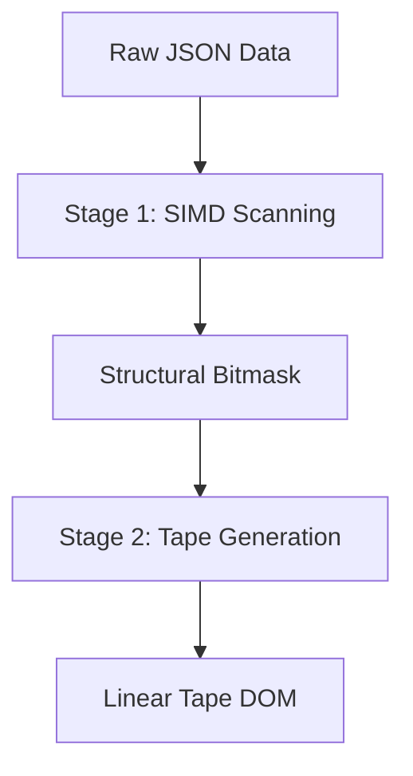

# SIMD Acceleration

Beast JSON's core parsing engine is split into two stages. Stage 1 is a dedicated SIMD scanner that identifies structural characters at hardware limits.

## 🚠 The Multi-Architecture Dispatcher

We don't just use SIMD; we use it **intelligently**. Beast JSON detects the CPU architecture at compile-time and dispatches to the most efficient vectorized implementation.

### 🚀 AVX-512 (Intel/AMD)
Leverages 512-bit registers and BMI2 instructions. 
- **Stage 1**: Scans 64 bytes in 1-2 cycles.
- **Structural Masking**: Uses `_mm512_mask_cmp_epi8_mask` to generate bitmasks for quotes, backslashes, and structural delimiters simultaneously.

### 🍎 ARM NEON (Apple Silicon / Graviton)
Highly optimized for Apple M-series chips.
- **128-bit Vectors**: Processes 16 bytes per instruction.
- **NEON Permutes**: Uses `tbl` and `tbx` logic for branchless categorization of structural tokens.

## 🌪 SWAR (SIMD Within A Register)

For systems without full SIMD support or small buffers, we fallback to **SWAR** (SIMD Within A Register). 
SWAR allows us to process 8 bytes at a time using standard 64-bit integer registers and bitwise tricks (e.g., bitwise-XOR mask for range detection).

### Architecture-Specific Prefetching
Beast JSON adjusts its prefetching distance based on the CPU's cache line size.
- **Apple Silicon**: 512B prefetch distance (highly aggressive for M-series).
- **Intel/AMD**: 64B-128B prefetch distance (standard for L1/L2 patterns).

## 🔄 Two-Phase Execution

## 🛡 Performance Gains

| Phase | Non-SIMD (Fallback) | NEON (M1/M2) | AVX-512 (Ice Lake) |
| :--- | ---:| ---:| ---:|
| **Scanning** | 450 MB/s | **2,400 MB/s** | **2,750 MB/s** |
| **Escaping** | 220 MB/s | **1,100 MB/s**| **1,450 MB/s**|

---

By using explicit intrinsics rather than relying on auto-vectorization, Beast JSON guarantees peak performance across every compiler and OS.
