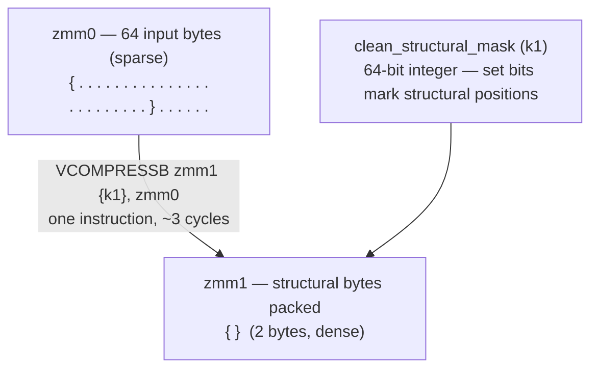
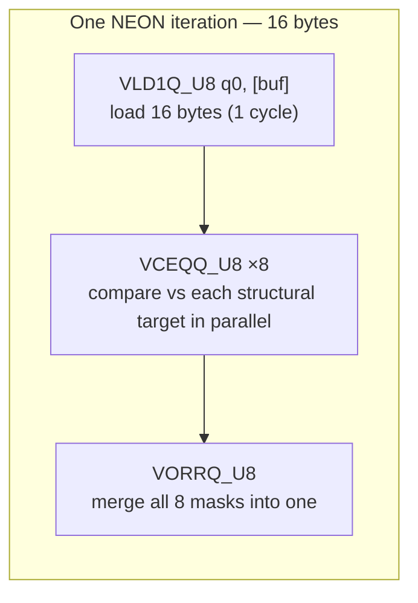

# SIMD Acceleration: Bitsliced Structural Analysis

Beast JSON replaces a character-by-character state machine with a **data-parallel byte classification engine**. Rather than branching on each byte, it classifies 64 bytes simultaneously using a single AVX-512 register, producing a sparse bitset of structural positions in a fraction of the time.

---

## The Scalar Baseline — Why It's Slow

A naive JSON scanner must branch on every byte:

```cpp
for (size_t i = 0; i < len; ++i) {
    char c = input[i];
    if      (c == '{') tape_push(OBJ_START);
    else if (c == '}') tape_push(OBJ_END);
    else if (c == '"') handle_string(i);
    // ... 6 more branches
}
```

On a modern superscalar CPU, this produces:
- A branch per byte → branch predictor thrash on real-world JSON
- One byte processed per iteration → unable to exploit instruction-level parallelism
- Maximum throughput: ~1 byte/cycle → ~3 GB/s at 3 GHz

Beast JSON's SIMD path achieves **64 bytes per cycle** on AVX-512 — a 64× improvement in classification throughput.

---

## Stage 1 → Stage 2: Interactive Pipeline Walkthrough

Step through the SIMD pipeline interactively — from raw bytes to TapeNodes:

<SimdPipeline />

On Intel Ice Lake and later, `VMOVDQU64` has 1 cycle latency and can be pipelined — the CPU overlaps loading window N+1 while processing window N.

---

## Stage 1a: Parallel Structural Character Detection

Instead of eight `if` branches, Beast JSON runs eight `VPCMPEQB` instructions. Each compares all 64 bytes against one target character and produces a 64-bit bitmask. For a 64-byte window, this produces a **64-bit integer** (`structural_mask`) identifying every structural character in **~8 cycles total**.

### What the mask looks like

For the input `{ "name": "Alice" }` (first 20 bytes shown):

```
Byte:         0  1  2  3  4  5  6  7  8  9 10 11 12 13 14 15 16 17 18 19
Input:        {     "  n  a  m  e  "  :     "  A  l  i  c  e  "        }
structural:   1  0  1  0  0  0  0  1  1  0  1  0  0  0  0  0  1  0  0  1
              ↑     ↑           ↑  ↑     ↑              ↑           ↑
              {     "           "  :     "              "           }
```

---

## Stage 1b: Quote-Region Masking (Prefix-XOR Carry)

The raw `structural_mask` still includes characters **inside string literals** — e.g., a `:` inside `"key:val"`. Beast JSON uses a **prefix-XOR carry** to suppress them.

The core insight: `in_string[i] = XOR of all unescaped quote bits from index 0 to i`.

```mermaid
flowchart TB
    subgraph STEP1["Step 1 — Locate backslashes and quotes"]
        direction LR
        BS["backslash_mask<br/>bit=1 at each '\\' position"]
        QM["raw_quote_mask<br/>bit=1 at each '\"' position"]
    end

    subgraph STEP2["Step 2 — Suppress escaped quotes"]
        direction TB
        ESC["escape_mask<br/>= backslash_mask shifted left by 1<br/>(marks the byte AFTER each backslash)"]
        REAL["real_quote_mask<br/>= raw_quote_mask AND NOT escape_mask<br/>(removes escaped quotes like \\\")"]
        ESC --> REAL
    end

    subgraph STEP3["Step 3 — Prefix-XOR via CLMUL"]
        direction TB
        CLMUL["PCLMULQDQ real_quote_mask, 0xFFFF...<br/>(carryless multiply = prefix XOR, 4 cycles)"]
        ISM["in_string_mask<br/>bit[i] = XOR(real_quote_mask[0..i])<br/>0 = outside string, 1 = inside string"]
        CLMUL --> ISM
    end

    CLEAN["clean_structural_mask<br/>= structural_mask AND NOT in_string_mask"]

    STEP1 --> STEP2 --> STEP3 --> CLEAN
```

### Worked example: colon inside a string

```
Input:          {    "  k  e  y  :  v  a  l  "  :  1  }
Byte index:     0    1  2  3  4  5  6  7  8  9 10 11 12 13

raw_quote_mask: 0    1  0  0  0  0  0  0  0  0  1  0  0  0
in_string_mask: 0    1  1  1  1  1  1  1  1  1  0  0  0  0
                     ╰─────────── inside string ───────────╯

raw_struct:     1    1  0  0  0  0  1  0  0  0  1  1  0  1
                                    ↑ false positive: : inside string
clean_struct:   1    1  0  0  0  0  0  0  0  0  1  1  0  1
                                    ↑ correctly suppressed
```

---

## Stage 1c: Structural Byte Extraction (VCOMPRESSB)

On Intel Ice Lake+, `VCOMPRESSB` packs the flagged bytes into a dense output in **one instruction**:



Stage 2 now iterates a **tiny dense buffer** — only structural characters — rather than the full input.

---

## Stage 2: Tape Generation via Bitset Iteration

Stage 2 uses `TZCNT` (trailing zero count) to iterate only the set bits in `clean_structural_mask`:

```mermaid
flowchart TB
    MASK["clean_structural_mask<br/>e.g. 0b...0001001010010001"]

    subgraph LOOP["Per-structural-character loop"]
        direction TB
        TZC["TZCNT: find index of next structural char<br/>(count trailing zeros — 1 cycle)"]
        CHAR["Load input[index]"]
        DISPATCH["switch(char) — 8 cases"]
        BLSR["BLSR: clear lowest set bit<br/>(advance to next — 1 cycle)"]
        TZC --> CHAR --> DISPATCH --> BLSR --> TZC
    end

    subgraph EMIT["TapeNode emitted per case"]
        direction TB
        E1["'{' / '}' / '[' / ']'<br/>→ OBJ/ARR node, record jump-patch"]
        E2["'\"'<br/>→ KEY or STRING, string_view into buf"]
        E3["digit / '-'<br/>→ number parse → UINT64 / INT64 / DOUBLE"]
        E4["'t' / 'f' / 'n'<br/>→ BOOL_TRUE / BOOL_FALSE / NULL"]
    end

    MASK --> LOOP --> EMIT
```

The loop body executes **once per structural character**. In typical JSON, structural characters are 5–15% of the input — Stage 2 is extremely cache-efficient.

---

## ARM NEON Path

On Apple Silicon and ARM64 servers, Beast JSON uses NEON 128-bit registers (16 bytes per load). The algorithm is identical; 4 NEON iterations cover 64 bytes:



NEON has no `VCOMPRESSB` equivalent. Beast JSON uses a `VBSL`-based gather with a compact scalar loop for Stage 2 on ARM — still far faster than a pure scalar parser.

---

## Throughput Summary

| Architecture | Register width | Bytes/cycle (Stage 1) | Throughput @ 3 GHz |
|:---|:---|:---|:---|
| x86-64 AVX-512 | 512-bit ZMM | ~8 bytes/cycle | ~24 GB/s (register bandwidth) |
| ARM NEON | 128-bit Q | ~4 bytes/cycle | ~12 GB/s |
| Scalar reference | 8-bit GPR | ~1 byte/cycle | ~3 GB/s |

End-to-end parse throughput (2.7 GB/s) is below the Stage-1 ceiling because memory bandwidth and Stage-2 tape generation are the bottleneck for large documents.

---

## Instruction Reference

| Instruction | ISA | Operation | Latency |
|:---|:---|:---|---:|
| `VMOVDQU64` | AVX-512 | Load 64 bytes unaligned | 1 cycle |
| `VPCMPEQB` | AVX-512 | Compare 64 bytes → 64-bit mask | 1 cycle |
| `KORQ` | AVX-512 | OR two 64-bit k-registers | 1 cycle |
| `PCLMULQDQ` | PCLMULQDQ | Carryless multiply (prefix XOR) | 4 cycles |
| `VCOMPRESSB` | AVX-512 VBMI | Pack masked bytes to dense | 3 cycles |
| `TZCNT` | BMI1 | Count trailing zeros | 3 cycles |
| `BLSR` | BMI1 | Reset lowest set bit | 1 cycle |
| `VLD1Q_U8` | NEON | Load 16 bytes | 1 cycle |
| `VCEQQ_U8` | NEON | Compare 16 bytes | 1 cycle |
