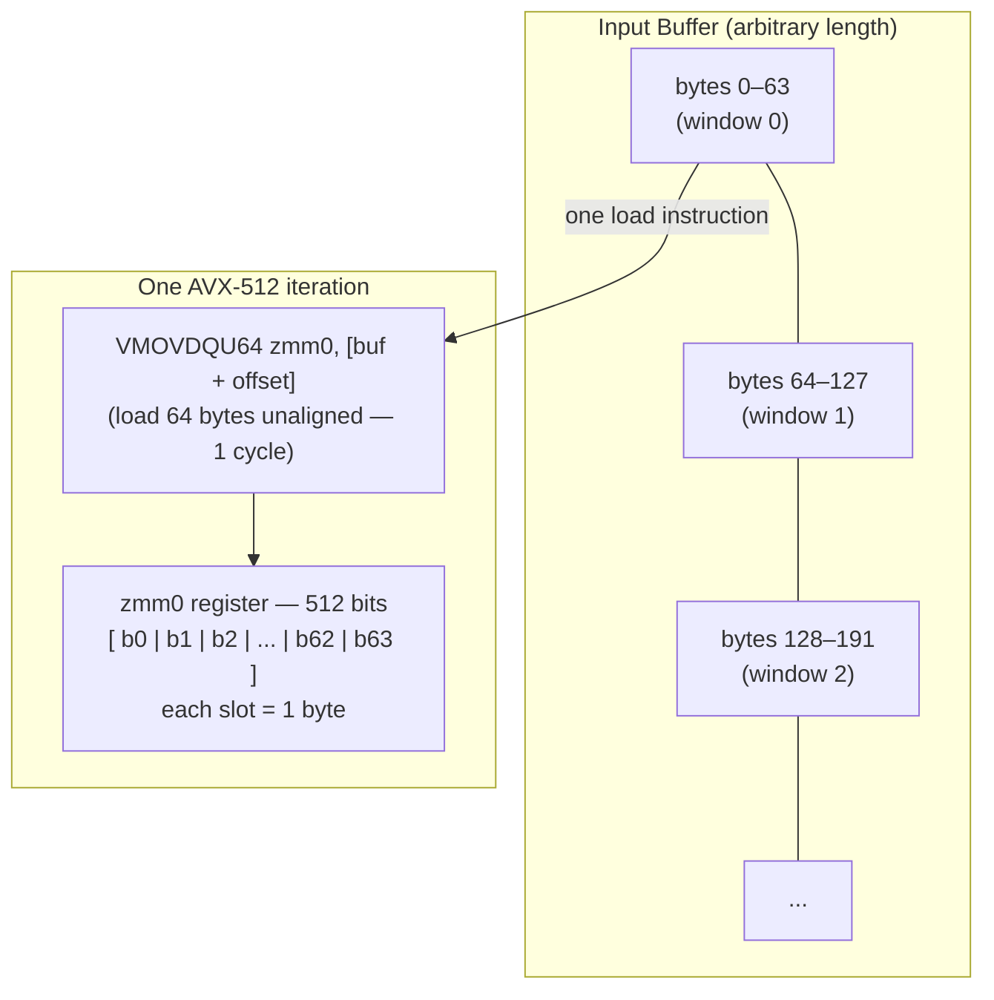
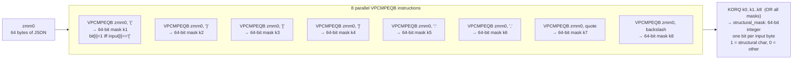
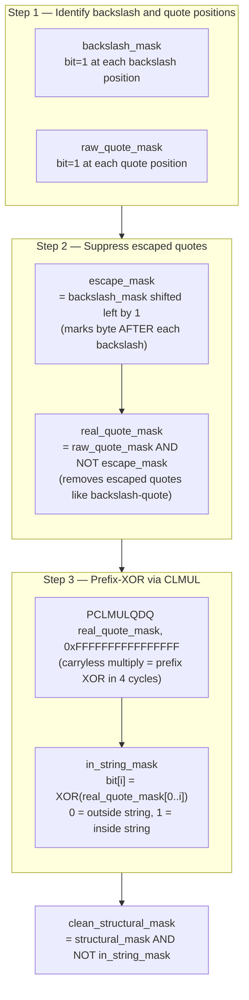
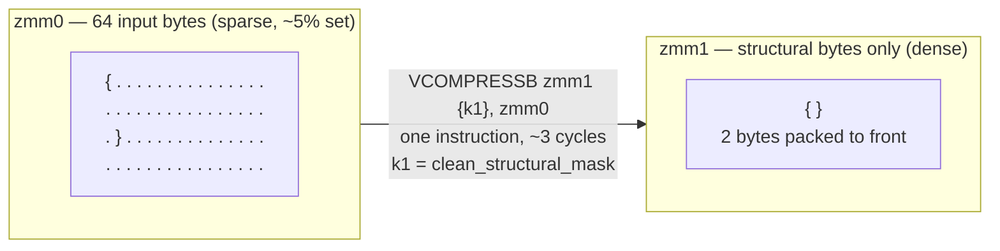
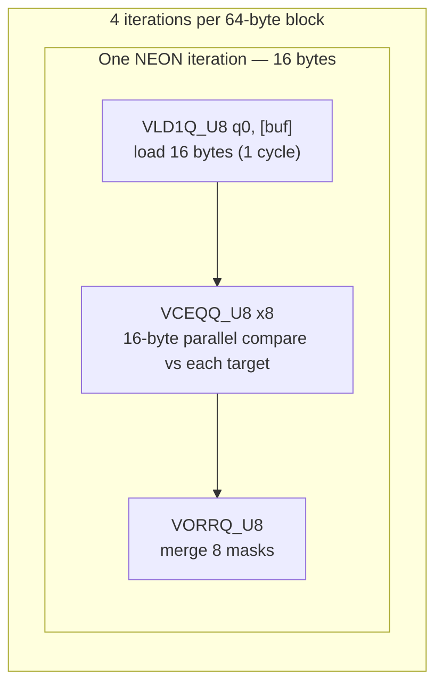
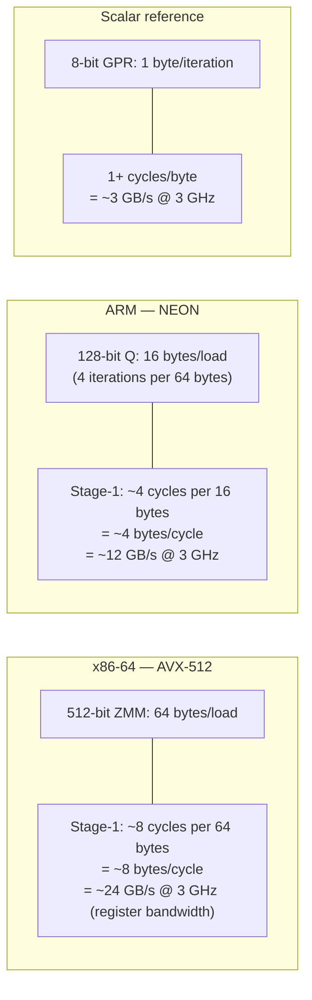

# SIMD Acceleration: Bitsliced Structural Analysis

Beast JSON replaces a character-by-character state machine with a **data-parallel byte classification engine**. Rather than branching on each byte, it classifies 64 bytes simultaneously using a single AVX-512 register, producing a sparse bitset of structural positions in a fraction of the time.

---

## The Scalar Baseline — Why It's Slow

A naive JSON scanner must branch on every byte:

```cpp
for (size_t i = 0; i < len; ++i) {
    char c = input[i];
    if      (c == '{') tape_push(OBJ_START);
    else if (c == '}') tape_push(OBJ_END);
    else if (c == '"') handle_string(i);
    // ... 6 more branches
}
```

On a modern superscalar CPU, this produces:
- A branch per byte → branch predictor thrash on real-world JSON
- One byte processed per iteration → unable to exploit instruction-level parallelism
- Maximum throughput: ~1 byte/cycle → ~3 GB/s at 3 GHz

Beast JSON's SIMD path achieves **64 bytes per cycle** on AVX-512 — a 64× improvement in classification throughput.

---

## Stage 1: Loading the 512-bit Window

The parser slides a 64-byte window across the input. Each iteration loads one 512-bit ZMM register:



On Intel Ice Lake and later, this load has **1 cycle latency** and can be pipelined — the CPU overlaps loading window N+1 while processing window N.

---

## Stage 1a: Parallel Structural Character Detection

Instead of eight `if` branches, Beast JSON runs eight `VPCMPEQB` instructions. Each compares all 64 bytes against one target character and produces a 64-bit bitmask:



For a 64-byte window, this produces a **64-bit integer** (`structural_mask`) identifying every structural character in **~8 cycles total**.

### What the mask looks like

For the input `{ "name": "Alice" }` (first 20 bytes shown):

```
Byte:         0  1  2  3  4  5  6  7  8  9 10 11 12 13 14 15 16 17 18 19
Input:        {     "  n  a  m  e  "  :     "  A  l  i  c  e  "        }
structural:   1  0  1  0  0  0  0  1  1  0  1  0  0  0  0  0  1  0  0  1
              ↑     ↑           ↑  ↑     ↑              ↑           ↑
              {     "           "  :     "              "           }
```

---

## Stage 1b: Quote-Region Masking (Prefix-XOR Carry)

The raw `structural_mask` includes characters **inside string literals** (e.g., a `:` inside `"key:val"`). These must be suppressed. Beast JSON uses a **prefix-XOR carry** — the hardest problem in SIMD JSON parsing — to identify in-string regions in O(log N) SIMD steps.

The core insight: `in_string[i] = XOR of all unescaped quote bits from index 0 to i`.



### Worked example: colon inside a string

```
Input:          {    "  k  e  y  :  v  a  l  "  :  1  }
Byte index:     0    1  2  3  4  5  6  7  8  9 10 11 12 13

raw_quote_mask: 0    1  0  0  0  0  0  0  0  0  1  0  0  0
in_string_mask: 0    1  1  1  1  1  1  1  1  1  0  0  0  0
                     ╰─────────── inside string ───────────╯

raw_struct:     1    1  0  0  0  0  1  0  0  0  1  1  0  1
                                    ↑ false positive: : inside string
clean_struct:   1    1  0  0  0  0  0  0  0  0  1  1  0  1
                                    ↑ suppressed correctly
```

---

## Stage 1c: Structural Byte Extraction (VCOMPRESSB)

On Intel Ice Lake+, `VCOMPRESSB` packs the flagged bytes into a dense output in **one instruction**:



Stage 2 now iterates a **tiny dense buffer** — only structural characters — rather than the full input.

---

## Stage 2: Tape Generation via Bitset Iteration

Stage 2 uses `TZCNT` (trailing zero count) to iterate only the set bits in `clean_structural_mask`:

```mermaid
flowchart TB
    MASK["clean_structural_mask\ne.g. 0b...0001001010010001"]

    subgraph LOOP["Per-structural-character loop"]
        direction TB
        TZC["TZCNT: position = count trailing zeros\n→ index of next structural char (1 cycle)"]
        CHAR["input[position] = structural char"]
        DISPATCH["switch(char) — 8 cases, branch-predictor friendly"]
        BLSR["BLSR: clear lowest set bit, advance to next\n(1 cycle)"]
        TZC --> CHAR --> DISPATCH --> BLSR --> TZC
    end

    subgraph EMIT["TapeNode emission per case"]
        direction LR
        E1["'{' / '}'\n'[' / ']'\n→ OBJ/ARR node\n   record jump-patch"]
        E2["'\"'\n→ KEY or STRING node\n   string_view into buf"]
        E3["':' / ','\n→ skip (state advance only)"]
        E4["digit / '-'\n→ number parse\n   UINT64/INT64/DOUBLE"]
        E5["'t' 'f' 'n'\n→ BOOL_TRUE\n   BOOL_FALSE / NULL"]
    end

    MASK --> LOOP --> EMIT
```

The loop body executes **once per structural character**. In typical JSON, structural characters are 5–15% of the input — Stage 2 is extremely cache-efficient.

---

## ARM NEON Path

On Apple Silicon and ARM64 servers, Beast JSON uses NEON 128-bit registers (16 bytes per load). The algorithm is identical; 4 NEON iterations cover 64 bytes:



NEON has no `VCOMPRESSB` equivalent. Beast JSON uses a `VBSL`-based gather with a compact scalar loop for Stage 2 on ARM — still far faster than a pure scalar parser.

---

## Throughput Summary



End-to-end parse throughput (2.7 GB/s) is below the Stage-1 ceiling because memory bandwidth and Stage-2 tape generation are the bottleneck for real documents.

---

## Instruction Reference

| Instruction | ISA | Operation | Latency |
|:---|:---|:---|---:|
| `VMOVDQU64` | AVX-512 | Load 64 bytes unaligned | 1 cycle |
| `VPCMPEQB` | AVX-512 | Compare 64 bytes → 64-bit mask | 1 cycle |
| `KORQ` | AVX-512 | OR two 64-bit k-registers | 1 cycle |
| `PCLMULQDQ` | PCLMULQDQ | Carryless multiply (prefix XOR) | 4 cycles |
| `VCOMPRESSB` | AVX-512 VBMI | Pack masked bytes to dense | 3 cycles |
| `TZCNT` | BMI1 | Count trailing zeros | 3 cycles |
| `BLSR` | BMI1 | Reset lowest set bit | 1 cycle |
| `VLD1Q_U8` | NEON | Load 16 bytes | 1 cycle |
| `VCEQQ_U8` | NEON | Compare 16 bytes | 1 cycle |
