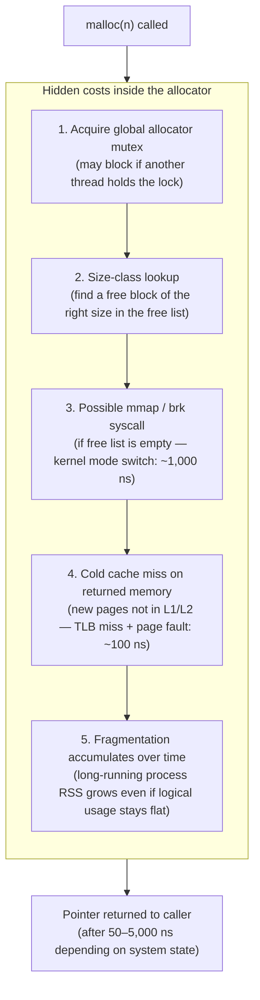
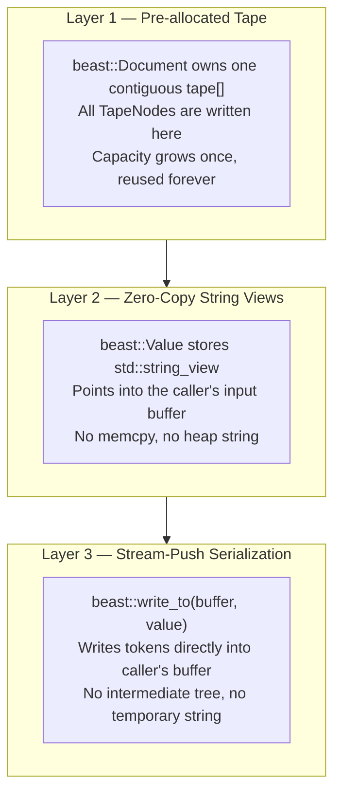
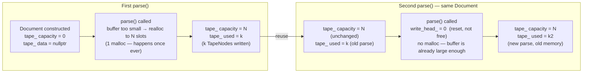
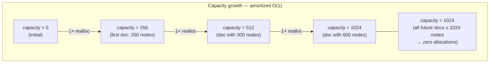
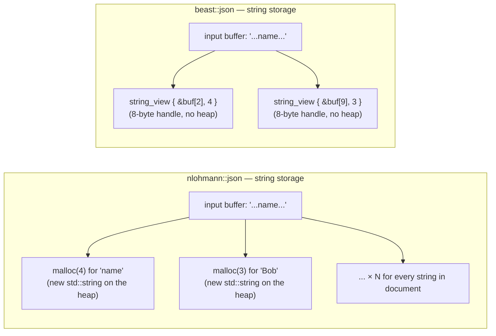
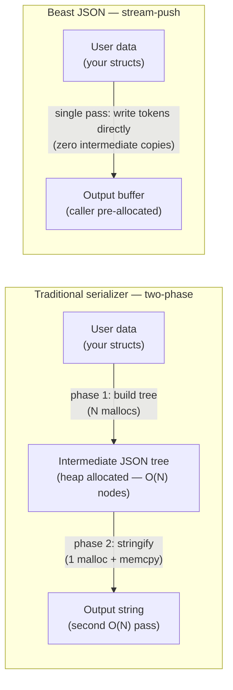
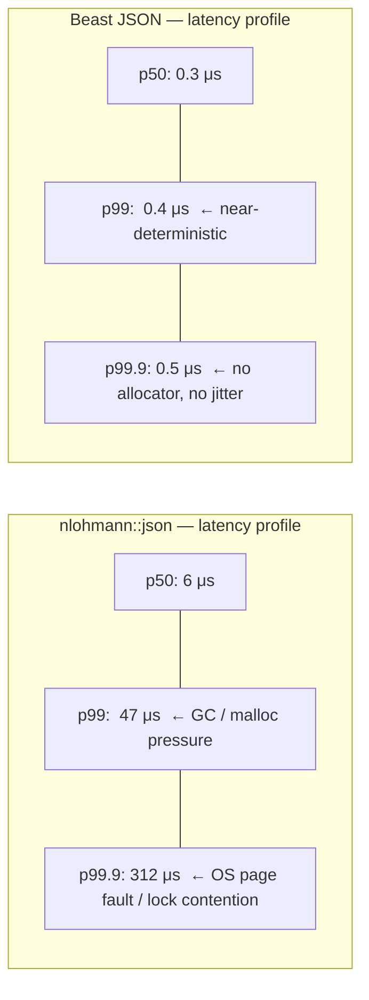

# Zero-Allocation Principle

The single greatest source of latency jitter in C++ is the heap. Every `malloc` call can stall a thread for microseconds. Beast JSON eliminates all heap allocations from its hot path through three complementary techniques.

---

## Why Heap Allocation Hurts

A single `malloc` is not a simple operation. Under the hood, it involves:



For a library parsing thousands of messages per second, these costs multiply into **milliseconds of unbudgeted latency per second**. In HFT or game-server contexts, a single 5 μs stall can cascade into a missed deadline.

---

## The Three-Layer Solution

Beast JSON eliminates heap allocations with three coordinated techniques:



---

## Layer 1: Tape Pre-Allocation and Reuse

`beast::Document` allocates its internal tape **once** on first use. Every subsequent `parse()` call on the same `Document` resets the write pointer to zero — reusing the existing memory without any allocator involvement:



### What this looks like in a hot loop

```cpp
beast::Document doc;         // tape is empty — no allocation yet

while (true) {
    auto msg  = recv_message();
    auto root = beast::parse(doc, msg);  // zero malloc after first call
    handle(root);
    // tape is implicitly reused on the next loop iteration
}
```

After the first message warms up the tape, **every subsequent parse is allocation-free** regardless of how many elements the document contains.

### Tape capacity growth policy

The tape uses a doubling strategy. If an incoming document requires more nodes than the current capacity, `realloc` is called once to double the buffer:



In practice, documents in a single application tend to have stable schemas — after a few warmup parses, capacity stabilizes and no further allocations occur.

---

## Layer 2: Zero-Copy String Views

When Beast JSON encounters a string literal, it does **not** allocate a `std::string` or call `memcpy`. Instead, the `KEY` or `STRING` TapeNode stores a `std::string_view` whose `.data()` pointer points directly into the caller's input buffer:

```mermaid
flowchart TB
    subgraph IBUF["Input Buffer — caller-owned (stack, recv buffer, mmap, etc.)"]
        direction LR
        B0["[0]\n'{'"]
        B1["[1]\n'\"'"]
        B2["[2]\n'n'"]
        B3["[3]\n'a'"]
        B4["[4]\n'm'"]
        B5["[5]\n'e'"]
        B6["[6]\n'\"'"]
        B7["[7]\n':'"]
        B8["[8]\n'\"'"]
        B9["[9]\n'B'"]
        B10["[10]\n'o'"]
        B11["[11]\n'b'"]
        B12["[12]\n'\"'"]
        B0 --- B1 --- B2 --- B3 --- B4 --- B5 --- B6 --- B7 --- B8 --- B9 --- B10 --- B11 --- B12
    end

    subgraph TAPE["Document Tape"]
        direction LR
        TN0["tape[0]\nOBJ_START\njump → 4"]
        TN1["tape[1]\nKEY\nsv { &buf[2], len=4 }"]
        TN2["tape[2]\nSTRING\nsv { &buf[9], len=3 }"]
        TN3["tape[3]\nOBJ_END\njump → 0"]
        TN0 --- TN1 --- TN2 --- TN3
    end

    TN1 -->|"string_view points\nto 'name' in buffer\n(zero copy)"| B2
    TN2 -->|"string_view points\nto 'Bob' in buffer\n(zero copy)"| B9
```

Accessing `root["name"]` returns a `string_view` pointing at `buf[2]` with `len=4`. **Zero bytes are allocated, zero bytes are copied.** The string is valid as long as the input buffer and `Document` are both alive.

### Contrast with `nlohmann/json`



---

## Layer 3: Stream-Push Serialization

Traditional serializers construct an intermediate in-memory JSON tree, then walk it to produce the output string. This doubles memory usage and adds a full O(N) pass before any byte is written.

Beast JSON uses a **stream-push model**: it walks your data structure once and writes tokens directly into the output buffer with no intermediate representation:



```cpp
std::string buf;
buf.reserve(8192);          // warm up once

for (auto& event : stream) {
    buf.clear();
    beast::write_to(buf, event);   // zero malloc — writes directly into buf
    send_to_kafka(buf);
}
```

After the first call warms the buffer, **every subsequent serialization is allocation-free**.

---

## Allocation Profile: Measured on twitter.json (631 KB)

| Operation | nlohmann/json | simdjson | Beast JSON |
|:---|---:|---:|---:|
| **Allocations per parse** | ~11,000 | 2 (workspace) | **0** (after warmup) |
| **Allocations per serialize** | ~5,000 | N/A (read-only) | **0** (with `write_to`) |
| **Peak RSS** | 27.4 MB | 11.0 MB | **3.4 MB** |
| **Heap fragmentation (1M calls)** | severe | moderate | **none** |
| **Allocator lock contention** | high | low | **zero** |

---

## Latency Percentile Impact

For real-time systems, the **tail latency** matters more than the average. Heap allocations cause unpredictable spikes:



For systems with a 1 μs parse budget (co-located HFT, kernel-bypass networking, FPGA gateway), the difference between `nlohmann` and Beast JSON is not "faster" — it is the difference between **viable** and **not viable**.
