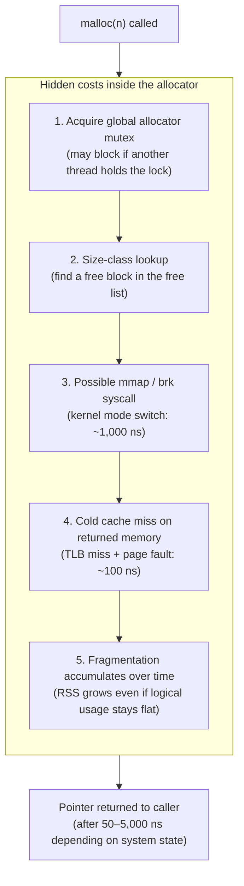
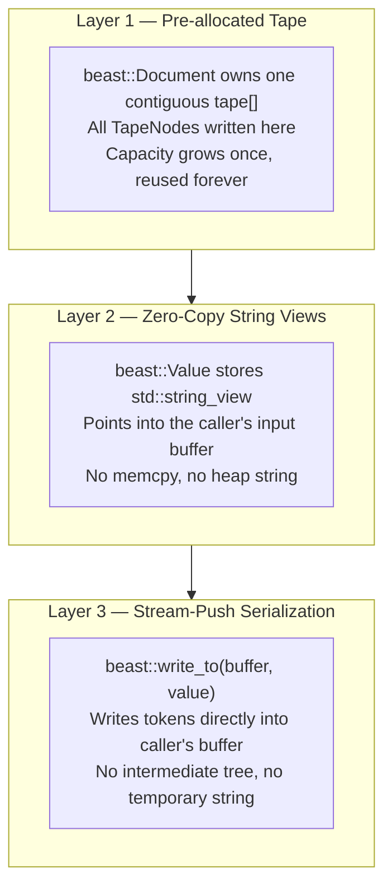
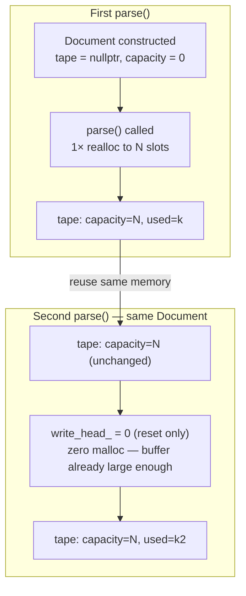
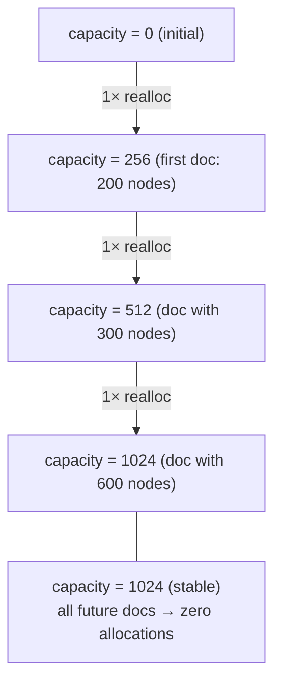
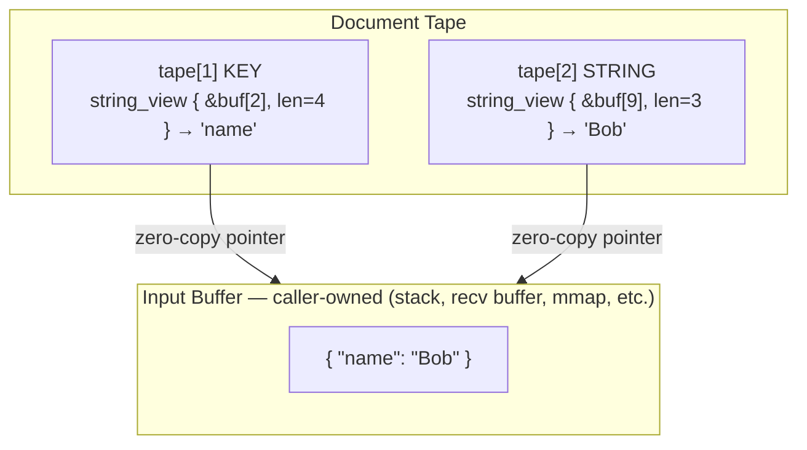
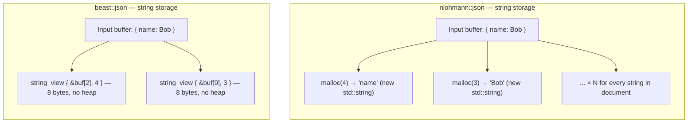
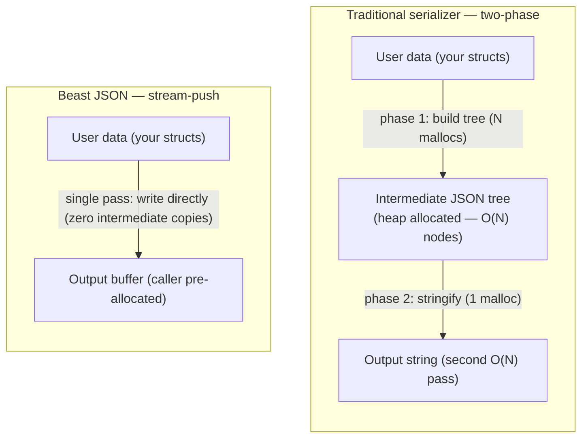

# Zero-Allocation Principle

The single greatest source of latency jitter in C++ is the heap. Every `malloc` call can stall a thread for microseconds. Beast JSON eliminates all heap allocations from its hot path through three complementary techniques.

---

## Why Heap Allocation Hurts

A single `malloc` is not a simple operation. Under the hood, it involves:



For a library parsing thousands of messages per second, these costs compound into **milliseconds of unbudgeted latency per second**. A single 5 μs stall can cascade into a missed deadline in HFT or game-server contexts.

---

## The Three-Layer Solution

Beast JSON eliminates heap allocations with three coordinated techniques:



---

## Layer 1: Tape Pre-Allocation and Reuse

`beast::Document` allocates its internal tape **once** on first use. Every subsequent `parse()` call on the same `Document` resets the write pointer to zero — reusing existing memory without any allocator involvement:



### What this looks like in a hot loop

```cpp
beast::Document doc;         // tape is empty — no allocation yet

while (true) {
    auto msg  = recv_message();
    auto root = beast::parse(doc, msg);  // zero malloc after first call
    handle(root);
    // tape is implicitly reused on the next loop iteration
}
```

After the first message warms up the tape, **every subsequent parse is allocation-free**.

### Tape capacity growth policy

The tape uses a doubling strategy. If an incoming document requires more nodes than the current capacity, `realloc` is called once to double the buffer:



In practice, documents in a single application tend to have stable schemas — after a few warmup parses, capacity stabilizes and no further allocations occur.

---

## Layer 2: Zero-Copy String Views

When Beast JSON encounters a string literal, it does **not** allocate a `std::string` or call `memcpy`. Instead, the `KEY` or `STRING` TapeNode stores a `std::string_view` pointing directly into the caller's input buffer:



Accessing `root["name"]` returns a `string_view` pointing at `buf[2]` with `len=4`. **Zero bytes are allocated, zero bytes are copied.**

> **Lifetime rule**: `string_view` values are valid as long as both the `Document` and the input buffer are alive. Do not hold a `string_view` after either goes out of scope.

### Contrast with `nlohmann/json`



---

## Layer 3: Stream-Push Serialization

Traditional serializers construct an intermediate in-memory JSON tree, then walk it to produce the output string. Beast JSON uses a **stream-push model**: it walks your data structure once and writes tokens directly into the output buffer:



```cpp
std::string buf;
buf.reserve(8192);          // warm up once

for (auto& event : stream) {
    buf.clear();
    beast::write_to(buf, event);   // zero malloc — writes directly into buf
    send_to_kafka(buf);
}
```

After the first call warms the buffer, **every subsequent serialization is allocation-free**.

---

## Allocation Profile: Measured on twitter.json (631 KB)

| Operation | nlohmann/json | simdjson | Beast JSON |
|:---|---:|---:|---:|
| **Allocations per parse** | ~11,000 | 2 (workspace) | **0** (after warmup) |
| **Allocations per serialize** | ~5,000 | N/A (read-only) | **0** (with `write_to`) |
| **Peak RSS** | 27.4 MB | 11.0 MB | **3.4 MB** |
| **Heap fragmentation (1M calls)** | severe | moderate | **none** |
| **Allocator lock contention** | high | low | **zero** |

---

## Latency Percentile Impact

For real-time systems, **tail latency** matters more than average. Heap allocations cause unpredictable spikes:

| Percentile | nlohmann/json | Beast JSON |
|:---|---:|---:|
| **p50** | 6 μs | **0.3 μs** |
| **p99** | 47 μs ← malloc pressure | **0.4 μs** |
| **p99.9** | 312 μs ← OS page fault | **0.5 μs** |

For systems with a 1 μs parse budget (co-located HFT, kernel-bypass networking, FPGA gateway), the difference between `nlohmann` and Beast JSON is not "faster" — it is the difference between **viable** and **not viable**.
